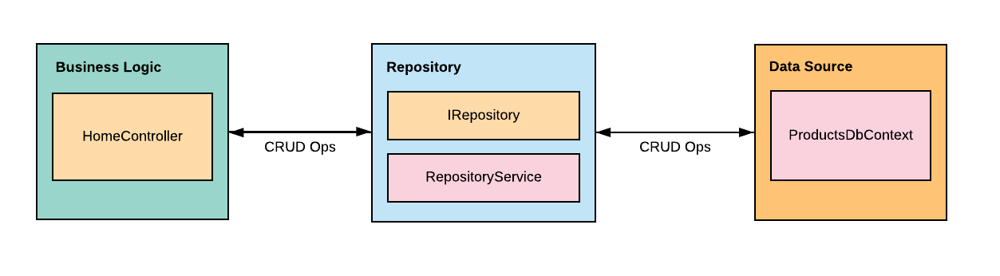

# Repository Design Pattern
The Repository design pattern is a way to organize your code so your data retrieval logic is separated from your business logic.  This decouples your data source layer from your business logic so the data source layer can be seamlessly swapped to another source if needed.  The actual Repository is a mediator between the two layers that queries the data.  The benefits to doing this allow for better testing, it centralizes the data logic, and provides a more flexible architecture.  This pattern is useful if you need to isolate the data layer to support unit testing, create a centralized data source that has consistant access rules and logic, and maintain the codes readability.

In this project, we are accomplishing this layer of seperation by adding these classes:
- ProductsDbContext.cs
- RepositoryService.cs
- IRepository.cs
- HomeController.cs



The IRepository.cs & RepositoryService.cs classes work together as our repository that serves as the bridge between our business logic and our data source layer.  The HomeController.cs class is what we implement the repository on.  The data model we are accessing of Products, set in the ProductsDbContext.cs, include the following attributes: Id, SKU, Name, Description, Price, Quantity.

#### Implementation


1. *Create Interface*, this serves as our level of seperation that can be implemented on multiple classes
```c#
    public interface IRepository
    {
        Task AddProduct(Products product);
        Task<Products> GetProduct(string id);
        Task<List<Products>> GetProducts();
        Task UpdateProduct(Products product);
        Task Delete(string id);
    }
````

2. *Create Service*, inject DbContext.  This is our connection to the database that we can build logic on
```c#
    public class RepositoryService : IRepository
    {
        private ProductsDbContext _context;

        public RepositoryService(ProductsDbContext context)
        {
            _context = context;
        }
    }
```


3. *Register in the startup*, in ConfigureServices
```c#
    services.AddScoped<IRepository, RepositoryService>();
```

4. *Inject onto desired classes*, this replaces any previous tightly coupled injection you may have had before
```c#
    public class HomeController : Controller
    {
        private readonly IRepository _context;

        public HomeController(IRepository context)
        {
            _context = context;
        }
    }
```

5. *Notice the seperation*, now that we are injecting the Interface instead of the database directly, we can use the query logic from out interface. Below, GetProducts() is our method from the Interface, and not the service directly.  This is implemented in our HomeController.cs.
```c#
    public async Task<IActionResult> Index()
    {
       return View(await _context.GetProducts());
    }
```


